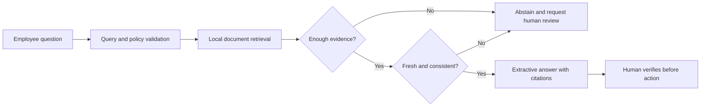

# Enterprise Knowledge Agent

[](https://github.com/magicyao2028-pixel/enterprise-knowledge-agent/actions/workflows/ci.yml)
[](LICENSE)

> 中文介绍：这是一个面向中小企业知识管理场景的离线 Agent 原型。它从经过批准的内部知识样例中检索证据，生成带来源引用的回答；当证据不足、来源过期、结构化政策值冲突，或问题涉及密钥与密码时主动拒答并转交人工。公开版本仅使用合成知识内容，不包含任何真实公司内部资料。

**Live prototype:** https://magicyao2028-pixel.github.io/enterprise-knowledge-agent/

## Project context

This portfolio edition documents an AI application and product practice explored in the business context of **Changsha Shiju Trading Co., Ltd.** The public repository uses synthetic policies and makes no claim of production deployment or measured user outcomes.

## Business problem

Policies, operating procedures and product knowledge are often scattered across chat messages and files. Employees spend time searching, receive inconsistent answers, and may act on stale or unsupported information. This prototype demonstrates a controlled knowledge workflow that:

- searches an approved local corpus;
- splits documents into stable, reviewable chunks before ranking;
- filters retrieval by department, tag and minimum update date;
- checks materially relevant sources for age and explicit review deadlines against a visible analysis date;
- detects different values for the same structured policy key and routes the ambiguity to a knowledge owner;
- returns an extractive answer with visible citations;
- exposes retrieval scores and an execution trace;
- abstains when no source supports an answer;
- conservatively blocks explicit requests for common credential types before retrieval;
- runs without a paid API or external data transfer.
- provides a 10–20 minute reviewer trial with a machine-readable evidence chain and safety-feedback replay.

## What this repository demonstrates

| Capability | Evidence |
| --- | --- |
| AI product discovery | [PRD](docs/PRD.md), users, scope and acceptance criteria |
| Agent workflow | Query validation, retrieval, evidence gate, answer composition and trace |
| Grounded output | Source IDs, document metadata and retrieved excerpts |
| Safety design | Abstention, sensitive-request boundary and human review flag |
| Evaluation thinking | [Evaluation plan](docs/EVALUATION.md) and automated test cases |
| Reproducible retrieval evidence | [Twelve-query baseline](reports/retrieval_evaluation.md) covering ranking, abstention and blocking |
| Controlled search scope | Stable chunk IDs plus department, tag and freshness filters |
| Knowledge governance | Explicit freshness report and structured conflicting-source gate |
| System planning | [Architecture](docs/ARCHITECTURE.md) with explicit v0.1 boundaries |
| Runnable proof | Python CLI, synthetic corpus and zero-cost [browser prototype](site/) |
| Trial readiness | [Reviewer trial](docs/TRIAL_GUIDE.md), [evidence index](evidence/evidence_index.json), external-intake decisions and synthetic safety regression |

## Core workflow



The current implementation uses deterministic lexical retrieval. It is an Agent workflow prototype, not a claim of advanced semantic RAG or an autonomous enterprise assistant.

## Quick start

Requirements: Python 3.10 or later. No third-party runtime dependency is required.

```bash
python -m pip install -e .
knowledge-agent "How quickly should an urgent complaint be escalated?"
knowledge-agent "What evidence is required for a damaged product return?" --output answer.json
knowledge-agent "How should a complaint be escalated?" --department "Customer Operations" --tag complaint --updated-after 2026-07-01
knowledge-agent "What is the domestic travel hotel reimbursement ceiling?" --corpus data/governance_fixture.json --as-of 2026-08-14
knowledge-agent "How many supplier quotes are required?" --corpus data/governance_fixture.json --as-of 2026-08-14 --max-source-age-days 90
python -m unittest discover -s tests -v
knowledge-agent-trial
```

To run without installation:

```bash
PYTHONPATH=src python -m enterprise_knowledge_agent.cli "How is AIGC content reviewed?"
```

To view the static prototype locally:

```bash
python -m http.server 8000 --directory site
```

Then visit `http://localhost:8000`.

## Corpus schema

The public sample is a JSON array using this shape:

```json
{
  "document_id": "KB-SVC-002",
  "title": "Customer Complaint Escalation Standard",
  "department": "Customer Operations",
  "updated_at": "2026-07-20",
  "review_due_at": "2026-12-31",
  "claim_key": "complaints.urgent_escalation_deadline",
  "claim_value": "30 minutes",
  "tags": ["complaint", "escalation"],
  "content": "Synthetic policy text"
}
```

## Honest boundaries

- The corpus is synthetic and small.
- Retrieval is English lexical matching, not embeddings or semantic search.
- Metadata filters are exact matches; they are not an authorization system.
- Answers are selected excerpts, not model-generated reasoning.
- Conflict detection requires an identical structured `claim_key`; it does not infer contradiction from free text.
- Freshness rules identify review risk, not whether a policy is legally or operationally valid.
- There is no authentication, tenant isolation, database, document ingestion pipeline or production deployment.
- Confidence is a transparent heuristic, not a calibrated probability.
- All operational decisions still require an authorized human.

These boundaries leave testable room for later maintenance instead of presenting a one-day prototype as a completed enterprise system.

## Documentation

- [Product requirements](docs/PRD.md)
- [System architecture](docs/ARCHITECTURE.md)
- [Evaluation plan](docs/EVALUATION.md)
- [Generated retrieval baseline](reports/retrieval_evaluation.md)
- [Security and governance](docs/SECURITY.md)
- [Maintenance plan](docs/MAINTENANCE_PLAN.md)
- [Current handoff](HANDOFF.md)
- [Changelog](CHANGELOG.md)
- [Reviewer trial guide](docs/TRIAL_GUIDE.md)
- [Machine-readable evidence index](evidence/evidence_index.json)
- [External component screening](evidence/external_intake.json)
- [Synthetic feedback case](evidence/feedback_case.json)

## Roadmap

- v0.1: offline retrieval, citations, abstention, tests and static demo;
- v0.2: evaluated query set and retrieval-quality report;
- v0.3: document chunking and metadata filters;
- v0.4: source freshness and structured conflicting-policy gates;
- v0.5: reviewer trial, evidence index, governed external screening and feedback regression (current);
- v0.6: optional local embedding adapter and lexical comparison benchmark;
- v0.7: service API, persistence and access-control design;
- v1.0: controlled private pilot with knowledge-owner review.

## License

MIT License. See [LICENSE](LICENSE).
