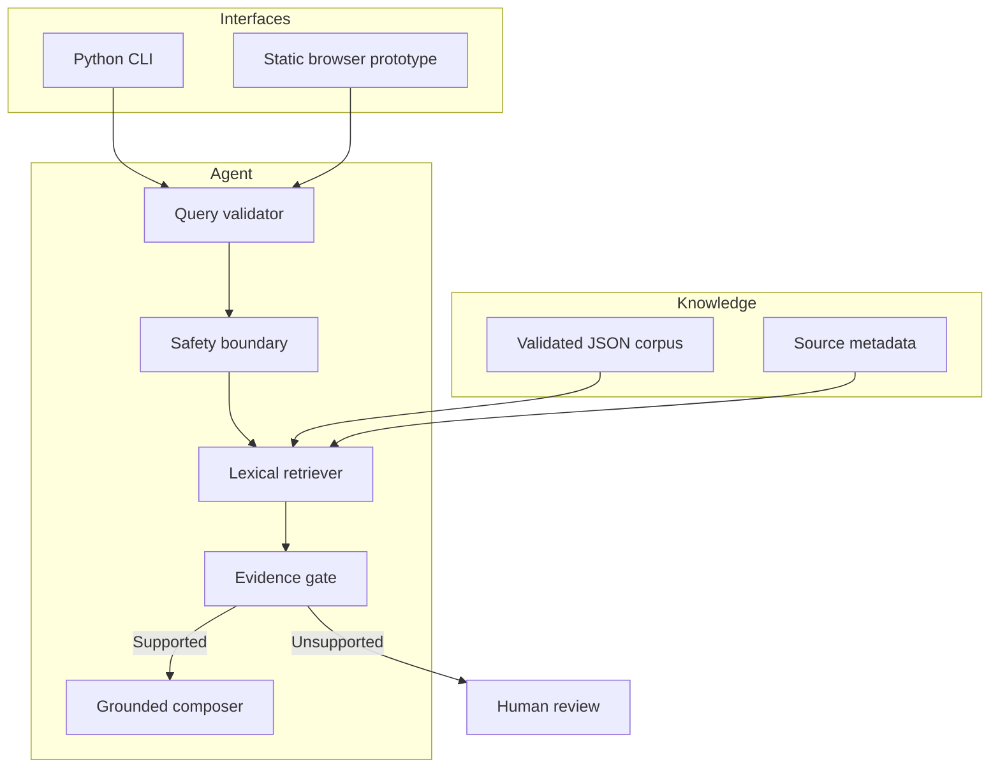
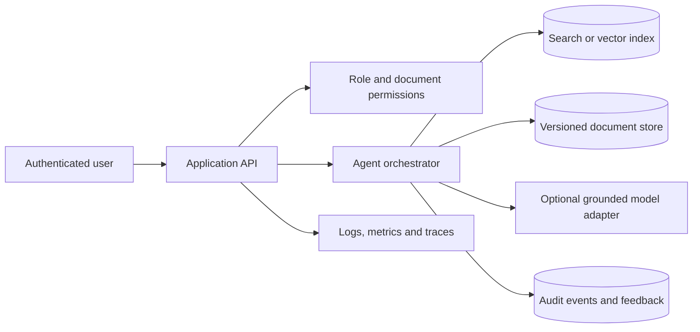

# System Architecture

## v0.1 design goals

- zero paid runtime dependency;
- citation-first answers;
- explicit abstention and human-review boundaries;
- reproducible retrieval behavior;
- no private enterprise data in the public repository.

## Logical architecture

The browser prototype mirrors the main decision flow for a zero-setup demonstration. The Python package is the reference implementation covered by automated tests.

## Component responsibilities

| Component | Responsibility |
| --- | --- |
| `models.py` | Validate knowledge-document structure and response evidence objects. |
| `corpus.py` | Load JSON, reject malformed content and duplicate identifiers. |
| `retrieval.py` | Tokenize, score, rank and extract the best supporting sentence. |
| `agent.py` | Orchestrate safety, evidence, confidence, citations and abstention. |
| `cli.py` | Provide local query and JSON-export interfaces. |
| `site/` | Show the product flow without a server or paid API. |

## Future production architecture

Production decisions still required include tenant isolation, permissions, encryption, retention, document versioning, conflicting-source handling, model budget, observability, incident response and deletion workflows.
